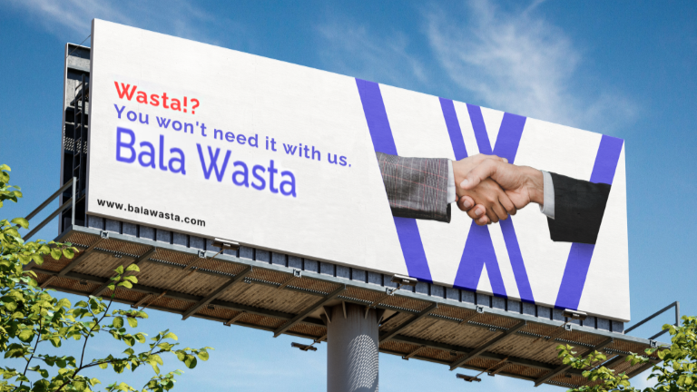

# BilaWasita – Job Opportunities Without Intermediaries

 <!-- ضع هنا صورة غلاف جميلة للتطبيق -->

## 📱 About the App

**BilaWasita** is a modern mobile platform built to connect **job seekers** directly with **recruiters**, removing the need for middlemen.  
Our mission is to make job opportunities more **accessible**, **fair**, and **transparent** for everyone.

Whether you're looking for your next career move or searching for the right candidate, BilaWasita is designed to help you connect faster and easier.

---

## 🌟 Key Features

- 🔍 Direct connection between job seekers and recruiters  
- 🧑‍💼 Separate user flows for job seekers and employers  
- 💬 Simple, modern, and intuitive UI  
- 🛠️ Profile creation, job posting, and job application

---

## 🎯 Our Vision

We believe everyone deserves equal access to opportunities. BilaWasita aims to break down barriers and create a job market that works for **everyone**, not just those with connections.

---

## 🖼️ Screenshots

| Job Seeker Flow | Recruiter Flow |
|-----------------|----------------|
|  |  |
|  |  |

> _More screenshots and demo coming soon..._

---

## 👥 Team

This app was developed by a group of university students passionate about creating meaningful digital solutions:

- [Your Name] – Project Lead  
- [Friend 1 Name] – UI/UX & Frontend  
- [Friend 2 Name] – Backend & Architecture  
- [Friend 3 Name] – Testing & Documentation  

---

## 📬 Contact

For inquiries, suggestions, or feedback:  
📧 [your.email@example.com]  
🌐 [LinkedIn / GitHub / Portfolio if any]

---

## 🧠 Note

This project is part of our university graduation project.  
We're proud to share it as an open-source initiative and are excited to keep improving it!

---

