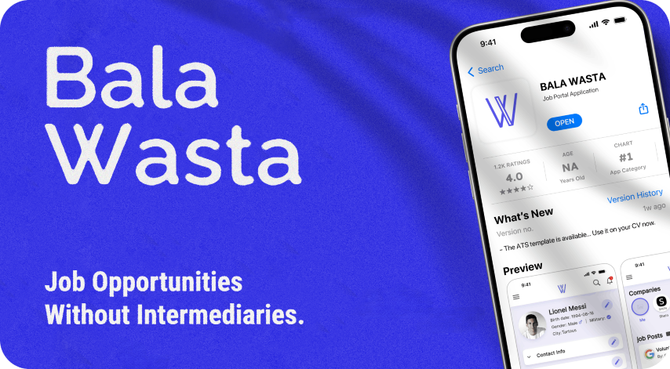
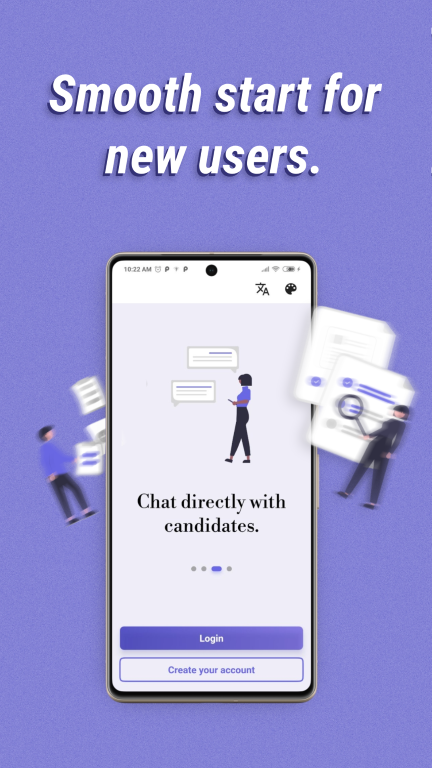
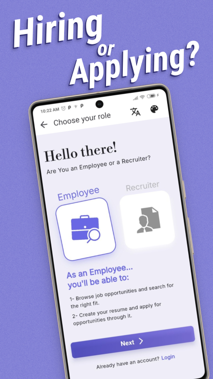
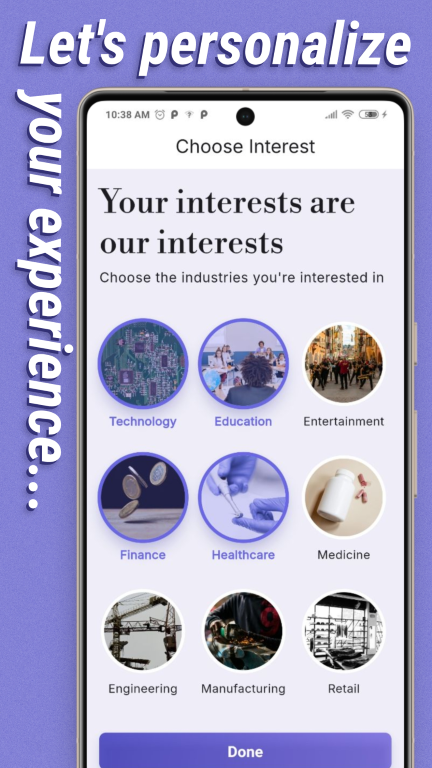
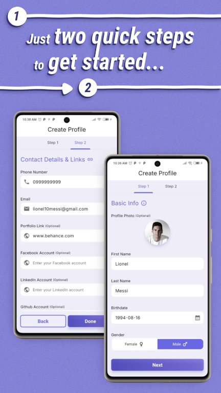
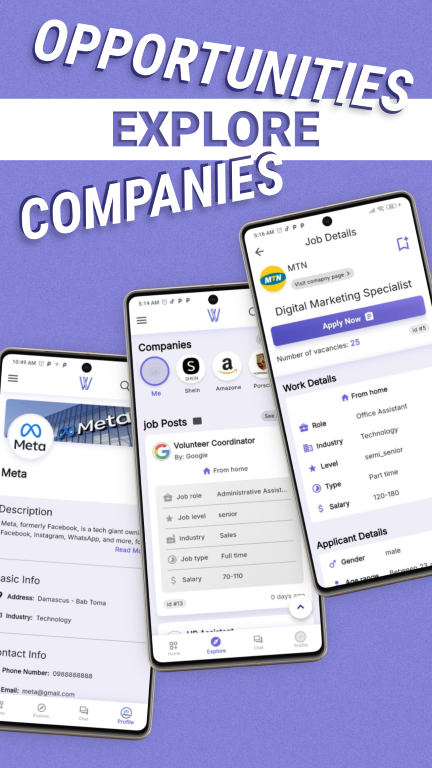
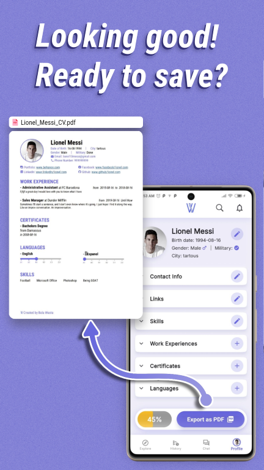

# 📱 Bala Wasta – Job Opportunities Without Intermediaries
### Bala Wasta... it means "without nepotism" in Arabic
 
## 🔍 Overview

**Bala Wasta** is a university project developed by a team of students from the Faculty of Informatics Engineering – Damascus University.  

The app provides a clean, direct, and fair platform that connects **job seekers** with **recruiters**, removing the need for intermediaries and restoring trust in the hiring process.

---

## 👥 Team

| Name                | Role       | Email                | Github |
|---------------------|------------|-----------------------|-----|
| **Raghad Sharouf**    | Frontend   | raghadadnan630@gmail.com    | raghad-adnan |
| **Rahaf Dayoub**    | Frontend   | rahafdayoub274@gmail.com     | https://github.com/RahafDayoub4 |
| **Rony Mansour**     | Frontend   | rony.e.mansor@gmail.com      | https://github.com/rony22mansor |
| **Hiba Mahmoud**     | Backend    | hiba.zaki.mahmoud@gmail.com      | https://github.com/hiba77moh |
| **Shadi Al-Salim**      | Backend    | shadisalim510@gmail.com     | https://github.com/ShadiAlsalim |

---

## 🎯 Goals

- Promote **equal access to job opportunities**
- Eliminate favoritism and **increase transparency**
- Support job seekers in finding roles that match their **skills and interests**
- Help companies and HR staff **manage job posts and communicate with candidates** efficiently

---

## 🖼️ Screenshots

|   |   ||
| ---| ---| ---|
|  |  ||
  |  | ||

---

## 🌟 Key Features

### For Job Seekers:
- Personal profile and **CV builder**
- Apply for jobs directly from within the app
- **Smart job recommendations** based on profile
- Save and manage job posts
- Download CV as **PDF**
- Filter jobs by industry, type, city, etc.
- View saved jobs **offline**

### For Recruiters:
- Create and manage job posts
- Auto-fill job details using role-based templates
- View and filter candidate applications
- Accept/reject applicants and send responses
- Start secure **in-app chats** with selected candidates

---

## 🧠 Smart Enhancements

- 🔁 Auto-complete & auto-fill for forms
- 🌐 Arabic & English language support
- 🌙 Dark Mode
- 📶 Offline mode with caching
- 📢 Smart notifications and alerts
- 🔍 Dual layout for browsing jobs (cards or minimal list)

---

## 🧰 Technologies

- **Flutter** for mobile app development  
- **Laravel** for backend API and role management  
- **Firebase** for messaging and notifications  
